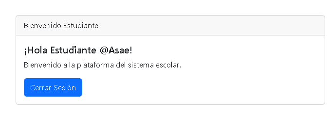

# Sitio Web para la clase de integrador 

Sitio web creado utilizando MVC, PHP Y MYSQL.


## Como Usarlo

Para la realización del proyecto utilizamos la herramienta laragon, en los archivos de este repositorio podras encontrar la base de datos, lo unico que debes hacer es importar la misma desde el panel de phpmyadmin. 

```bash
  1. abre laragon
  2. Iniciar Todo
  3. Clic derecho, entrar a las opciones de mysql y abre phpmyadmin e importa la base de datos.
```

una vez realizado esto lo unico que debes hacer es copiar la estructura del proyecto dentro de tu carpeta www la cual se encuentra en los archivos de laragon. 

## Screenshots


## Otros Perfiles

Contamos con tres tipos de perfiles: admin, docente y estudiante. 



